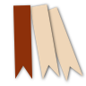

#  Bookmark-Visitor

Information about the [Usage](./usage.md).

[Contributing](./contributing.md) has information about how to contribute to Bookmark-Visitor, by
filing bug reports or feature requests, to contributing source code, to adding documentation
or translations or any other way you can help.

## Links

Further Information about some Markdown note programs and Emacs' Org-Mode:

- [Obsidian](https://obsidian.md/)
- [Zettlr](https://zettlr.com/)
- [Joplin](https://joplinapp.org/)
- [Org-Mode website](https://orgmode.org/)
